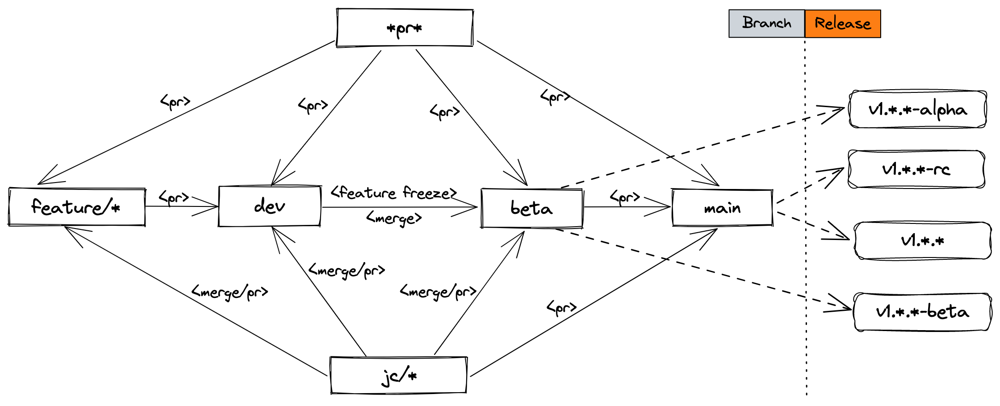

### 安装说明


### 方式一. 手动安装（推荐）

克隆代码库

   ```sh
   git clone https://github.com/rocboss/paopao-ce.git
   ```

#### 后端

1. 导入项目根目录下的 `scripts/paopao.sql` 文件至MySQL数据库
2. 拷贝项目根目录下 `config.yaml.sample` 文件至 `config.yaml`，按照注释完成配置编辑
3. 编译后端    
    编译api服务:
    ```sh
    make build
    ```
    编译api服务、内嵌web前端ui:
    ```sh
    make build
    ```
    也可以使用精简模式编译，不内嵌web前端ui:
    ```sh
    make build TAGS='slim embed'
    ```
    编译后在`release`目录可以找到对应可执行文件。
    ```sh
    release/paopao
    ```

4. 直接运行后端    
    运行api服务:
    ```sh
    make run
    ```
    运行api服务、web前端ui服务:
    ```sh
    make run TAGS='embed'
    ```
    提示: 如果需要内嵌web前端ui，请先构建web前端(建议设置web/.env为VITE_HOST="")。

5. 使用内置的Migrate机制自动升级维护SQL DDL:
    ```sh
    # 添加 Migration 功能到 Features 中 开启migrate功能
    vim config.yaml
    # file: config.yaml
    # Features:
    #   Default: ["Base", "MySQL", "Zinc", "MinIO", "LoggerZinc", "Migration"]
   
    # 编译时加入migration tag编译出支持migrate功能的可执行文件
    make build TAGS='migration'
    release/paopao

    # 或者 带上migration tag直接运行
    make run TAGS='migration'
    ```
    > 注意：默认编译出来的可执行文件是不内置migrate功能，需要编译时带上migration tag才能内置支持migrage功能。


#### 前端

1. 进入前端目录 `web`，拷贝`.env` 到 `.env.local`，编辑 `.env.local ` 文件中后端服务地址及其他配置项，下载依赖包

    ```sh
    cd ./web && cp .env .env.local
    vim .env.local
    yarn
    ```

2. 编译前端

    ```sh
    yarn build
    ```

    build完成后，可以在dist目录获取编译产出，配置nginx指向至该目录即可

#### 桌面端

1. 进入前端目录 `web`，拷贝`.env` 到 `.env.local`，编辑 `.env.local ` 文件中后端服务地址及其他配置项，下载依赖包

    ```sh
    cd ./web && cp .env .env.local
    vim .env.local
    yarn
    ```

2. 编译前端

    ```sh
    yarn build
    ```
   
3. 构建桌面端
   ```sh
   yarn tauri build
   ```
   桌面端是使用[Rust](https://www.rust-lang.org/) + [tauri](https://github.com/tauri-apps/tauri)编写
   的，需要安装tauri的依赖，具体参考[https://tauri.studio/v1/guides/getting-started/prerequisites](https://tauri.studio/v1/guides/getting-started/prerequisites).


### 方式二. 使用Docker构建、运行
  * 后端:
  ```sh
  # 默认参数构建, 默认内嵌web ui并设置api host为空
  docker build -t your/paopao-ce:tag .

  # 内嵌web ui并且自定义API host参数
  docker build -t your/paopao-ce:tag --build-arg API_HOST=http://api.paopao.info .

  # 内嵌web ui并且使用本地web/.env中的API host
  docker build -t your/paopao-ce:tag --build-arg USE_API_HOST=no .

  # 内嵌web ui并且使用本地编译的web/dist构建
  docker build -t your/paopao-ce:tag --build-arg USE_DIST=yes .

  # 只编译api server
  docker build -t your/paopao-ce:tag --build-arg EMBED_UI=no .

  # 运行
  mkdir custom && docker run -d -p 8008:8008 -v ${PWD}/custom:/app/paopao-ce/custom -v ${PWD}/config.yaml.sample:/app/paopao-ce/config.yaml your/paopao-ce:tag

  # 或者直接运行构建好的docker image
  mkdir custom && docker run -d -p 8008:8008 -v ${PWD}/custom:/app/paopao-ce/custom -v ${PWD}/config.yaml.sample:/app/paopao-ce/config.yaml bitbus/paopao-ce:latest
  ```

  * 前端:
  ```sh
  cd web

  # 默认参数构建
  docker build -t your/paopao-ce:web .

  # 自定义API host 参数构建
  docker build -t your/paopao-ce:web --build-arg API_HOST=http://api.paopao.info .

  # 使用本地编译的dist构建
  docker build -t your/paopao-ce:web --build-arg USE_DIST=yes .

  # 运行
  docker run -d -p 8010:80 your/paopao-ce:web
  ```

  * All-In-One:
  ```sh
  # 构建Image
  docker buildx build --build-arg USE_DIST="yes" -t your/paopao-ce:all-in-one-latest -f Dockerfile.allinone .

  # 运行
  docker run --name paopao-ce-allinone  -d -p 8000:8008 -p 7700:7700 -v ./data/custom:/app/custom -v ./data/meili_data:/app/meili_data your/paopao-ce:all-in-one-latest

  # 或者使用官方Image运行
  docker run --name paopao-ce-allinone  -d -p 8000:8008 -p 7700:7700 -v ./data/custom:/app/custom -v ./data/meili_data:/app/meili_data bitbus/paopao-ce:all-in-one-latest

  # 或者使用官方Image运行 + 自定义config.yaml
  docker run --name paopao-ce-allinone  -d -p 8000:8008 -p 7700:7700 -v ./config.yaml:/app/config.yaml -v ./data/custom:/app/custom -v ./data/meili_data:/app/meili_data bitbus/paopao-ce:all-in-one-latest
  ```
  > 注意在`config.yaml` 中`Meili.ApiKey`的值必须与容器中meili启动时设定的`MEILI_MASTER_KEY`环境变量值相同，默认为`paopao-meilisearch`. 可以在docker启动容器时通过`-e MEILI_MASTER_KEY=<custom-key>`设置该值。


### 方式三. 使用 docker-compose 运行
```sh
git clone https://github.com/rocboss/paopao-ce.git
cd paopao-ce && docker compose up -d
# visit http://localhost:8008  👀 paopao-ce
# visit http://localhost:8001  👀 RedisInsight
# visit http://localhost:8080  👀 phpMyAdmin
```

默认是使用config.yaml.sample的配置，如果需要自定义配置，请拷贝默认配置文件(比如config.yaml)，修改后再同步配置到docker-compose.yaml如下：

```
# file: docker-compose.yaml
...
  backend:
    image: bitbus/paopao-ce:latest
    restart: always
    depends_on:
      - db
      - redis
      - zinc
    # modify below to reflect your custom configure
    volumes:
      - ./config.yaml:/app/paopao-ce/config.yaml
    ports:
      - 8008:8008
    networks:
      - paopao-network
....
```

> 注意：默认提供的 docker-compose.yaml 初衷是搭建本机开发调试环境，如果需要产品部署供外网访问，请自行调优配置参数或使用其他方式部署。

### 开发文档
#### Docs文档说明
`docs`目录提供了各种开发文档，包括：  
* [deploy](docs/deploy/)     - paopao-ce部署文档
* [discuss](docs/discuss/)   - 开发相关的问题交流论述文档
* [openapi](docs/openapi/)   - paopao-ce后端导出API文档
* [proposal](docs/proposal/) - paopao-ce功能特性提按文档
> 比如，关于paopao-ce的设计定位，可以参考[docs/proposal/22110411-关于paopao-ce的设计定位](docs/proposal/22110411-关于paopao-ce的设计定位.md)，简要阐述了paopao-ce是如何定位自身的。

#### API文档
开发者可以在本地开启`Docs`服务，浏览后端导出的API服务接口文档。  
* `config.yaml` 添加 `Docs` 功能项:
```yaml
...
Features:
  Default: ["Base", "MySQL", "Option", "LocalOSS", "LoggerFile", "Docs"]
  Docs: ["Docs:OpenAPI"]
...
```

* 构建时将 `docs` 添加到TAGS中:
```sh
make run TAGS='docs'

# visit http://127.0.0.1:8011/docs/openapi
```

### 配置说明

`config.yaml.sample` 是一份完整的配置文件模版，paopao-ce启动时会读取`./custom/config.yaml`、`./config.yaml`任意一份配置文件（优先读取最先找到的文件）。

```sh
cp config.yaml.sample config.yaml
vim config.yaml # 修改参数
paopao serve
```

配置文件中的 `Features` 小节是声明paopao-ce运行时开启哪些功能项:

```yaml
...

Features:
  Default: ["Base", "MySQL", "Option", "LocalOSS", "LoggerFile"]
  Develop: ["Base", "MySQL", "Option", "Sms", "AliOSS", "LoggerOtlp"]
  Demo: ["Base", "MySQL", "Option", "Sms", "MinIO", "LoggerOtlp"]
  Slim: ["Base", "Sqlite3", "LocalOSS", "LoggerFile"]
  Base: ["Zinc", "Redis", "Alipay",]
  Option: ["SimpleCacheIndex"]
  Sms: "SmsJuhe"

...
```

如上： 
Default/Develop/Demo/Slim 是不同 功能集套件(Features Suite)， Base/Option 是子功能套件， Sms是关于短信验证码功能的参数选项。

这里 `Default`套件 代表的意思是： 使用`Base/Option` 中的功能，外加 `MySQL/LocalOSS/LoggerFile`功能，也就是说开启了`Zinc/Redis/Alipay/SimpleCacheIndex/MySQL/LocalOSS/LoggerFile` 7项功能； 
`Develop`套件依例类推。 

使用Feautures:

```sh
release/paopao serve --help
Usage of release/paopao:
  -features value
        use special features
  -no-default-features
        whether use default features

# 默认使用 Default 功能套件
release/paopao serve

# 不包含 default 中的功能集，仅仅使用 develop 中声明的功能集
release/paopao serve --no-default-features --features develop 

# 使用 default 中的功能集，外加 sms 功能
release/paopao serve --features sms  

# 手动指定需要开启的功能集
release/paopao serve --no-default-features --features sqlite3,localoss,loggerfile,redis 
```

目前支持的功能集合:
| 功能项 | 类别 | 状态 | 备注 |
| ----- | ----- | ----- | ----- |
|`Web` | 子服务 | 内测 | 开启Web服务|
|`Admin` | 子服务 | WIP | 开启Admin后台运维服务|
|`SpaceX` | 子服务 | WIP | 开启SpaceX服务|
|`Bot` | 子服务 | WIP | 开启Bot服务|
|`NativeOBS` | 子服务 | WIP | 开启NativeOBS服务|
|`Docs` | 子服务 | WIP | 开启开发者文档服务|
|`Frontend:Web` | 子服务 | 稳定 | 开启独立前端服务|
|`Frontend:EmbedWeb` | 子服务 | 稳定 | 开启内嵌于后端Web API服务中的前端服务|
|`Gorm` | 数据库 | 稳定(默认) | 使用[gorm](https://github.com/go-gorm/gorm)作为数据库的ORM，默认使用 `Gorm` + `MySQL`组合|
|`Sqlx`| 数据库 | WIP | 使用[sqlx](https://github.com/jmoiron/sqlx)作为数据库的ORM|
|`Sqlc`| 数据库 | WIP | 使用[sqlc](https://github.com/kyleconroy/sqlc)自动生成ORM代码|
|`MySQL`| 数据库 | 稳定(默认) | 使用MySQL作为数据库|
|`Postgres`| 数据库 | 稳定 | 使用PostgreSQL作为数据库|
|`Sqlite3`| 数据库 | 稳定 | 使用Sqlite3作为数据库|
|`AliOSS` | 对象存储 | 稳定(推荐) |阿里云对象存储服务|
|`COS` | 对象存储 | 内测 |腾讯云对象存储服务|
|`HuaweiOBS` | 对象存储 | 内测 |华为云对象存储服务|
|`MinIO` | 对象存储 | 稳定 |[MinIO](https://github.com/minio/minio)对象存储服务|
|`S3` | 对象存储 | 内测 |AWS S3兼容的对象存储服务|
|`LocalOSS` | 对象存储 | 内测 |提供使用本地目录文件作为对象存储的功能，仅用于开发调试环境|
|`OSS:Retention` | 对象存储 | 内测 |基于对象存储系统的对象过期自动删除特性实现 先创建临时对象再持久化的功能|
|`OSS:TempDir` | 对象存储 | 内测 |基于对象存储系统的对象拷贝/移动特性实现 先创建临时对象再持久化的功能|
|`Redis` | 缓存 | 稳定 | Redis缓存功能 |
|`SimpleCacheIndex` | 缓存 | Deprecated | 提供简单的 广场推文列表 的缓存功能 |
|`BigCacheIndex` | 缓存 | Deprecated | 使用[BigCache](https://github.com/allegro/bigcache)缓存 广场推文列表，缓存每个用户每一页，简单做到千人千面 |
|`RedisCacheIndex` | 缓存 | Deprecated | 使用Redis缓存 广场推文列表，缓存每个用户每一页，简单做到千人千面 |
|`Zinc` | 搜索 | Deprecated | 基于[Zinc](https://github.com/zinclabs/zinc)搜索引擎提供推文搜索服务 |
|`Meili` | 搜索 | 稳定(推荐) | 基于[Meilisearch](https://github.com/meilisearch/meilisearch)搜索引擎提供推文搜索服务 |
|`Bleve` | 搜索 | WIP | 基于[Bleve](https://github.com/blevesearch/bleve)搜索引擎提供推文搜索服务 |
|[`Sentry`](docs/proposal/23040412-关于使用sentry用于错误追踪与性能检测的设计.md) | 监控 | 内测 | 使用Sentry进行错误跟踪与性能监控 |
|`LoggerFile` | 日志 | 稳定 | 使用文件写日志 |
|`LoggerZinc` | 日志 | Deprecated | 使用[Zinc](https://github.com/zinclabs/zinc)写日志 |
|`LoggerMeili` | 日志 | Deprecated | 使用[Meilisearch](https://github.com/meilisearch/meilisearch)写日志 |
|`LoggerOpenObserve` | 日志 | Deprecated | 使用[OpenObserve](https://github.com/openobserve/openobserve)写日志 |
|`LoggerOtlp` | 日志 | 内测 | 使用[OpenTelemetry](https://github.com/open-telemetry/opentelemetry-go)写日志 |
|[`Friendship`](docs/proposal/22110410-关于Friendship功能项的设计.md) | 关系模式 | 内置 Builtin | 弱关系好友模式，类似微信朋友圈 |
|[`Followship`](docs/proposal/22110409-关于Followship功能项的设计.md) | 关系模式 | 内置 Builtin | 关注者模式，类似Twitter的Follow模式 |
|[`Lightship`](docs/proposal/22121409-关于Lightship功能项的设计.md) | 关系模式 | 弃用 Deprecated | 开放模式，所有推文都公开可见 |
|`Alipay` | 支付 | 稳定 | 开启基于[支付宝开放平台](https://open.alipay.com/)的钱包功能 |
|`Sms` | 短信验证 | 稳定 | 开启短信验证码功能，用于手机绑定验证手机是否注册者的；功能如果没有开启，手机绑定时任意短信验证码都可以绑定手机 |
|`Docs:OpenAPI` | 开发文档 | 稳定 | 开启openapi文档功能，提供web api文档说明(visit http://127.0.0.1:8008/docs/openapi) |
|[`Pyroscope`](docs/proposal/23021510-关于使用pyroscope用于性能调试的设计.md)| 性能优化 | 内测 | 开启Pyroscope功能用于性能调试 |   
|[`Pprof`](docs/proposal/23062905-添加Pprof功能特性用于获取Profile.md)| 性能优化 | 内测 | 开启Pprof功能收集Profile信息 |  
|`PhoneBind` | 其他 | 稳定 | 手机绑定功能 |   
|`UseAuditHook` | 其他 | 内测 | 使用审核hook功能 |   
|`DisableJobManager` | 其他 | 内测 | 禁止使用JobManager功能 |   
|`Web:DisallowUserRegister` | 功能特性 | 稳定 | 不允许用户注册 |     

> 功能项状态详情参考 [features-status](features-status.md).
     
### 搭建依赖环境
#### [Zinc](https://github.com/zinclabs/zinc) 搜索引擎:
* Zinc运行
```sh
# 创建用于存放zinc数据的目录
mkdir -p data/zinc/data

# 使用Docker运行zinc
docker run -d --name zinc --user root -v ${PWD}/data/zinc/data:/data -p 4080:4080 -e ZINC_FIRST_ADMIN_USER=admin -e ZINC_FIRST_ADMIN_PASSWORD=admin -e DATA_PATH=/data public.ecr.aws/zinclabs/zinc:latest

# 查看zinc运行状态
docker ps
CONTAINER ID   IMAGE                                COMMAND                  CREATED        STATUS        PORTS                    NAMES
41465feea2ff   getmeili/meilisearch:v0.27.0         "tini -- /bin/sh -c …"   20 hours ago   Up 20 hours   0.0.0.0:7700->7700/tcp   paopao-ce-meili-1
7daf982ca062   public.ecr.aws/prabhat/zinc:latest   "/go/bin/zinc"           3 weeks ago    Up 6 days     0.0.0.0:4080->4080/tcp   zinc

# 使用docker compose运行
docker compose up -d zinc
# visit http://localhost:4080 打开自带的ui管理界面
```

* 修改Zinc配置
```yaml
# features中加上 Zinc 和 LoggerZinc
Features:
  Default: ["Zinc", "LoggerZinc", "Base", "Sqlite3", "BigCacheIndex","MinIO"]
...
LoggerZinc: # 使用Zinc写日志
  Host: 127.0.0.1:4080  # 这里的host就是paopao-ce能访问到的zinc主机
  Index: paopao-log
  User: admin
  Password: admin
  Secure: False         # 如果使用https访问zinc就设置为True
...
Zinc: # Zinc搜索配置
  Host: 127.0.0.1:4080
  Index: paopao-data
  User: admin
  Password: admin
  Secure: False
```

#### [Meilisearch](https://github.com/meilisearch/meilisearch) 搜索引擎:
* Meili运行
```sh
mkdir -p data/meili/data

# 使用Docker运行
docker run -d --name meili -v ${PWD}/data/meili/data:/meili_data -p 7700:7700 -e MEILI_MASTER_KEY=paopao-meilisearch getmeili/meilisearch:v0.29.0
# visit http://localhost:7700 打开自带的搜索前端ui

# 使用docker compose运行，需要删除docker-compose.yaml中关于meili的注释
docker compose up -d meili

# 查看meili运行状态
docker compose ps
NAME                   COMMAND                  SERVICE             STATUS              PORTS
paopao-ce-meili-1      "tini -- /bin/sh -c …"   meili               running             0.0.0.0:7700->7700/tcp
```

* 修改Meili配置
```yaml
# features中加上 Meili 和 LoggerMeili
Features:
  Default: ["Meili", "LoggerMeili", "Base", "Sqlite3", "BigCacheIndex","MinIO"]
...
LoggerMeili: # 使用Meili写日志
  Host: 127.0.0.1:7700
  Index: paopao-log
  ApiKey: paopao-meilisearch
  Secure: False
  MinWorker: 5               # 最小后台工作者, 设置范围[5, 100], 默认5
  MaxLogBuffer: 100          # 最大log缓存条数, 设置范围[10, 10000], 默认100
...
Meili: # Meili搜索配置
  Host: 127.0.0.1:7700      # 这里的host就是paopao-ce能访问到的meili主机
  Index: paopao-data
  ApiKey: paopao-meilisearch
  Secure: False             # 如果使用https访问meili就设置为True
```

#### [MinIO](https://github.com/minio/minio) 对象存储服务
* MinIO运行
```sh
mkdir -p data/minio/data

# 使用Docker运行
docker run -d --name minio -v ${PWD}/data/minio/data:/data -p 9000:9000 -p 9001:9001 -e MINIO_ROOT_USER=minio-root-user -e  MINIO_ROOT_PASSWORD=minio-root-password -e MINIO_DEFAULT_BUCKETS=paopao:public bitnami/minio:latest

# 使用docker compose运行， 需要删除docker-compose.yaml中关于minio的注释
docker compose up -d minio
```

* 修改Minio配置
```yaml
# features中加上 MinIO
Features:
  Default: ["MinIO", "Meili", "LoggerMeili", "Base", "Sqlite3", "BigCacheIndex"]
...
MinIO: # MinIO 存储配置
  AccessKey: Q3AM3UQ867SPQQA43P2F      # AccessKey/SecretKey 需要登入minio管理界面手动创建，管理界面地址: http://127.0.0.1:9001
  SecretKey: zuf+tfteSlswRu7BJ86wekitnifILbZam1KYY3TG
  Secure: False
  Endpoint: 127.0.0.1:9000             # 根据部署的minio主机修改对应地址
  Bucket: paopao                       # 如上，需要在管理界面创建bucket并赋予外部可读写权限
  Domain: 127.0.0.1:9000               # minio外网访问的地址(如果想让外网访问，这里需要设置为外网可访问到的minio主机地址)
...
```

#### [OpenObserve](https://github.com/openobserve/openobserve) 日志收集、指标度量、轨迹跟踪
* OpenObserve运行
```sh
# 使用Docker运行
mkdir data && docker run -v $PWD/data:/data -e ZO_DATA_DIR="/data" -p 5080:5080 \
    -e ZO_ROOT_USER_EMAIL="root@paopao.info" -e ZO_ROOT_USER_PASSWORD="paopao-ce" \
    public.ecr.aws/zinclabs/openobserve:latest

# 使用docker compose运行， 需要删除docker-compose.yaml中关于openobserve的注释
docker compose up -d openobserve
# visit http://loclahost:5080
```

* 修改LoggerOpenObserve配置
```yaml
# features中加上 LoggerOpenObserve
Features:
  Default: ["Meili", "LoggerOpenObserve", "Base", "Sqlite3", "BigCacheIndex"]
...
LoggerOpenObserve: # 使用OpenObserve写日志
  Host: 127.0.0.1:5080
  Organization: paopao-ce
  Stream: default
  User: root@paopao.info
  Password: tiFEI8UeJWuYA7kN
  Secure: False
...
```

#### [Pyroscope](https://github.com/pyroscope-io/pyroscope) 性能剖析
* Pyroscope运行
```sh
mkdir -p data/minio/data

# 使用Docker运行
docker run -it -p 4040:4040 pyroscope/pyroscope:latest server
# 使用docker compose运行， 需要删除docker-compose.yaml中关于pyroscope的注释
docker compose up -d pyroscope
# visit http://loclahost:4040
```

* 修改Pyroscope配置
```yaml
# features中加上 Pyroscope
Features:
  Default: ["Meili", "LoggerMeili", "Base", "Sqlite3", "BigCacheIndex", "Pyroscope"]
...
Pyroscope: # Pyroscope配置
  AppName: "paopao-ce"
  Endpoint: "http://localhost:4040"   # Pyroscope server address
  AuthToken:                          # Pyroscope authentication token
  Logger:  none                       # Pyroscope logger (standard | logrus | none)
...
```

### 源代码分支管理 
**主代码库`github.com/rocboss/paopao-ce`**      
```bash
git branch
main
beta
alpha
dev
jc/alimy
jc/orziz
r/paopao-ce
r/paopao-pro
r/paopao-plus
r/paopao-xtra
r/paopao-mini
```
**分支说明**  
| 名称 | 说明 | 备注|
| ----- | ----- | ----- |       
| [`main`](https://github.com/rocboss/paopao-ce) | 主分支 |分支`main`是主分支，也是paopao-ce的稳定版本发布分支，只有经过内部测试，没有重大bug出现的稳定代码才会推进到这个分支；该分支主要由`beta`分支代码演进而来，原则上**只接受bug修复PR**。`rc版本/稳定版本` 发布都应该在`main`主分支中进行。|
| [`beta`](https://github.com/rocboss/paopao-ce/tree/beta) | 公测分支 |分支`beta`是公测分支，代码推进到`main`主分支的候选分支；该分支主要由`alpha`分支代码演进而来，**接受bug修复以及新功能优化的PR**，原则上不接受新功能PR。`beta版本` 发布都应该在`beta`公测分支下进行。|
| [`alpha`](https://github.com/rocboss/paopao-ce/tree/alpha) | 内测分支 |分支`alpha`是内测分支，代码推进到`beta`分支的候选分支；该分支主要由`dev`分支代码演进而来，**接受bug修复以及新功能相关的PR**，接受新功能PR。分支代码演进到一个里程碑式的阶段后**冻结所有新功能**，合并代码到`beta`公测分支进行下一阶段的持续演进。`alpha版本` 发布都应该在`alpha`内测分支下进行。|   
| [`dev`](https://github.com/rocboss/paopao-ce/tree/dev) | 开发分支 | 分支`dev`是开发分支，**不定期频繁更新**，接受 *新功能PR、代码优化PR、bug修复PR*；**新功能PR** 都应该首先提交给`dev`分支进行合并，bug修复/新功能开发/代码优化 **阶段性冻结** 后将代码演进合并到`alpha`分支。|   
| `feature/*` | 子功能分支 |`feature/*`是新功能子分支，一般新功能子分支都是 *从`dev`开发分支fork出来的*；子功能分支 **只专注于该新功能** 代码的开发/优化，待开发接近内测阶段 *提交新功能PR给`dev`分支进行review/merge*，待新功能代码演进到`beta`分支后，原则上是可以删除该分支，但也可以保留到稳定版本发布。**该分支专注于新功能的开发，只接受新功能的bug修复/优化PR**。|
| `jc/*` |维护者的开发分支|`jc/*`是代码库维护者的开发分支，一般包含一些局部优化或者bug修复代码，有时可以直接将代码merge到`dev/beta`分支，原则上不允许直接merge代码到`main`主分支。|
| `x/*` |实验分支|`x/*`是技术实验分支，某些技术的引入需要经过具体的代码实现与真实场景的测评，考量评估后如果某项技术适合引入到paopao-ce，就fork出一个`feature/*`分支，作为新功能引入到paopao-ce。一般一些比较激进的技术，从`dev`分支fork出一个新的`x/*`分支，各种尝试、考量、评估后，或丢弃、或引入到paopao-ce。|   
| `t/*` | 临时分支 |`t/*`是临时发版本分支，一般 `beta` 分支演进到正式版本发布前的最后某个beta版本（比如v0.2.0-beta)就从beta分支fork出一个 `t/*` 分支用于向 `main` 分支提交 PR 用于Review，待 PR Reviewed 合并到 `main` 分支后，可以删除这个临时创建的分支。这样设计主要是考虑到有时合并到 `main` 分支时，需要Review的时间可能会长一些，而dev分支的代码又急需推进到beta分支以发布下一个alpha版本用于内测，相当于为下一个测试版本发布腾地方。|  
| `r/*` |发行版本分支|`r/*`是不同发行版本分支，不同发行版本各有不同的侧重点，可以根据需要选择适合的发行版本。|

**发行版本分支说明**  
| 名称 | 说明 | 维护者 | 备注 |
| ----- | ----- | ----- | ----- |   
|[`paopao-ce`](https://github.com/rocboss/paopao-ce/tree/dev)|paopao-ce 主发行版本|[ROC](https://github.com/rocboss 'ROC')|该分支 [数据逻辑层](https://github.com/rocboss/paopao-ce/tree/dev/internal/dao/jinzhu) 使用[gorm](https://github.com/go-gorm/gorm)作为数据逻辑层的ORM框架，适配MySQL/PostgreSQL/Sqlite3数据库。| 
|[`r/paopao-ce`](https://github.com/rocboss/paopao-ce/tree/r/paopao-ce)|paopao-ce 主分支预览版本|[ROC](https://github.com/rocboss 'ROC')<br/>[北野](https://github.com/alimy 'Michael Li')|该分支 [数据逻辑层](https://github.com/rocboss/paopao-ce/tree/dev/internal/dao/jinzhu) 使用[gorm](https://github.com/go-gorm/gorm)作为数据逻辑层的ORM框架，适配MySQL/PostgreSQL/Sqlite3数据库。代码较`main`分支新，是主发行版本的前瞻预览版本。|
|[`r/paopao-ce-plus`](https://github.com/rocboss/paopao-ce/tree/r/paopao-ce-plus)|paopao-ce-plus 发行版本|[北野](https://github.com/alimy 'Michael Li')|该分支 [数据逻辑层](https://github.com/rocboss/paopao-ce/tree/r/paopao-ce-plus/internal/dao/sakila) 使用[sqlx](https://github.com/jmoiron/sqlx)作为数据逻辑层的ORM框架，专注于为MySQL/PostgreSQL/Sqlite3使用更优化的查询语句以提升数据检索效率。建议熟悉[sqlx](https://github.com/jmoiron/sqlx)的开发人员可以基于此版本来做 二次开发。|
|[`r/paopao-ce-pro`](https://github.com/rocboss/paopao-ce/tree/r/paopao-ce-pro)|paopao-ce-pro 发行版本|[北野](https://github.com/alimy 'Michael Li')|该分支 [数据逻辑层](https://github.com/rocboss/paopao-ce/tree/r/paopao-ce-pro/internal/dao/slonik) 使用[sqlc](https://github.com/kyleconroy/sqlc)作为sql语句生成器自动生成ORM代码，专门针对特定数据库MySQL/PostgreSQL进行查询优化，熟悉[sqlc](https://github.com/kyleconroy/sqlc)的开发人员可以基于此版本来做 二次开发。(另：分支目前只使用[pgx-v5](https://github.com/jackc/pgx)适配了PostgreSQL数据库，后续或许会适配MySQL/TiDB数据库。)|
|[`r/paopao-ce-xtra`](https://github.com/rocboss/paopao-ce/tree/r/paopao-ce-xtra)|paopao-ce-xtra 发行版本|[北野](https://github.com/alimy 'Michael Li')|该分支 是r/paopao-ce、r/paopao-ce-plus、r/paopao-ce-pro的合集|
|[`r/paopao-ce-mini`](https://github.com/rocboss/paopao-ce/tree/r/paopao-ce-mini)|paopao-ce-mini 发行版本|[北野](https://github.com/alimy 'Michael Li')|该分支是paopao-ce最小可用版本，专注于个人部署、一键傻瓜式最简部署|

**代码分支演进图**        


### 部署站点信息
* [官方 paopao.info](https://www.paopao.info)  
> 具体部署站点信息请查阅 [deployed-sites](./deployed-sites.md 'deployed sites'). 欢迎站长将已部署PaoPao实例的站点信息添加到 [deployed-sites](./deployed-sites.md 'deployed sites') 列表中。

#### Collaborator's paopao account
| 昵称 | [@GitHub](https://github.com 'github.com') | [@PaoPao](https://www.paopao.info 'paopao.info') |
| ----- | ----- | ----- | 
| ROC | [ROC](https://github.com/rocboss 'ROC')|[ROC](https://www.paopao.info/#/u?s=roc 'ROC @roc')|
| [北野](https://alimy.me '糊涂小栈') | [Michael Li](https://github.com/alimy 'Michael Li') | [alimy](https://www.paopao.info/#/u?s=alimy '北野 @alimy')|
| [orzi!](https://orzi.me 'orzi! - 做一个有想法的人') | [orzi!](https://github.com/orziz 'orzi!')| [orzi](https://www.paopao.info/#/u?s=orzi 'orzi @orzi') |

### 其他说明

建议后端服务使用 `supervisor` 守护进程，并通过 `nginx` 反向代理后，提供API给前端服务调用。

短信通道使用的[聚合数据](https://www.juhe.cn/)，如果申请不下来，可以考虑替换其他服务商。

代码结构比较简单，很方便扩展，开发文档请参阅[docs](docs '开发文档').

<!-- MARKDOWN LINKS & IMAGES -->
[contributors-shield]: https://img.shields.io/github/contributors/rocboss/paopao-ce?style=flat
[contributors-url]: https://github.com/rocboss/paopao-ce/graphs/contributors
[goreport-shield]: https://goreportcard.com/badge/github.com/rocboss/paopao-ce
[goreport-url]: https://goreportcard.com/report/github.com/rocboss/paopao-ce
[forks-shield]: https://img.shields.io/github/forks/rocboss/paopao-ce?style=flat
[forks-url]: https://github.com/rocboss/paopao-ce/network/members
[stars-shield]: https://img.shields.io/github/stars/rocboss/paopao-ce.svg?style=flat
[stars-url]: https://github.com/rocboss/paopao-ce/stargazers
[issues-shield]: https://img.shields.io/github/issues/rocboss/paopao-ce.svg?style=flat
[issues-url]: https://github.com/rocboss/paopao-ce/issues
[license-shield]: https://img.shields.io/github/license/rocboss/paopao-ce.svg?style=flat
[license-url]: https://github.com/rocboss/paopao-ce/blob/master/LICENSE.txt
[linkedin-shield]: https://img.shields.io/badge/-LinkedIn-black.svg?style=flat&logo=linkedin&colorB=555
[product-light-screenshot]: https://assets.paopao.info/static/paopao-light.jpeg
[product-dark-screenshot]: https://assets.paopao.info/static/paopao-dark.jpeg
