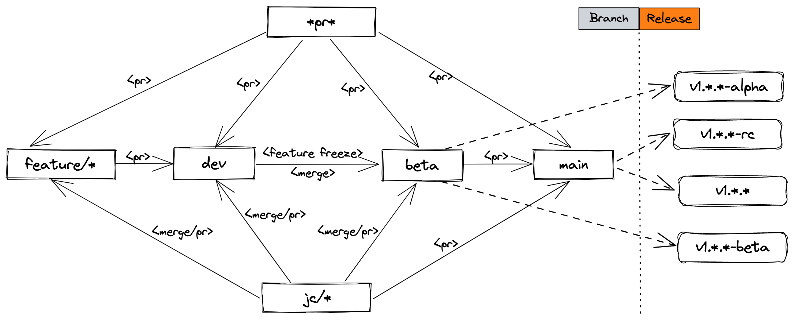

<div id="top"></div>

<!-- PROJECT SHIELDS -->
[](https://github.com/rocboss/paopao-ce/actions/workflows/go.yml)
[![Go Report Card][goreport-shield]][goreport-url]
[![Forks][forks-shield]][forks-url]
[![Stargazers][stars-shield]][stars-url]
[![MIT License][license-shield]][license-url]
[![Contributors][contributors-shield]][contributors-url]
[](https://sourcegraph.com/github.com/rocboss/paopao-ce)

<!-- PROJECT LOGO -->
<div align="center">
  <a href="https://github.com/rocboss/paopao-ce">
    
  </a>

  <h3 align="center">PaoPao</h3>

  <p align="center">
    🔥一个清新文艺的微社区
    <br />
    <a href="https://www.paopao.info/">View Demo</a>
    ·
    <a href="https://github.com/rocboss/paopao-ce/pulls">Pull Request</a>
    ·
    <a href="https://www.yuque.com/rocs/paopao/about">Features</a>
  </p>
</div>

---

## 预览
Web端：  
[![明色主题][product-light-screenshot]](https://www.paopao.info)

[![暗色主题][product-dark-screenshot]](https://www.paopao.info)

更多演示请前往[官网](https://www.paopao.info)体验（谢绝灌水）  

桌面端：  


<p align="right">(<a href="#top">back to top</a>)</p>

## 🛠 技术栈

PaoPao主要由以下优秀的开源项目/工具构建  
#### 后端:
* [Go](https://go.dev/ 'go')
* [Gin](https://gin-gonic.com/ 'gin')
* [Mir](https://github.com/alimy/mir 'go-mir')
* [Meilisearch](https://www.meilisearch.com/ 'meilisearch')
* [OpenTelemetry](https://github.com/open-telemetry/opentelemetry-go 'OpenTelemetry')
* [OpenObserve](https://github.com/openobserve/openobserve 'OpenObserve')

#### 前端: 
* [Naive UI](https://www.naiveui.com/)
* [Vue.js](https://vuejs.org/)
* [Vite.js](https://vitejs.dev/)
* [tauri](https://github.com/tauri-apps/tauri 'tauri')

<!-- GETTING STARTED -->
## 🏗 快速开始

### 环境要求

* Go (1.22+)
* Node.js (14+)
* MySQL (5.7+)
* Redis
* Meilisearch

以上环境版本为PaoPao官方的开发版本，仅供参考，其他版本的环境未进行充分测试

### 安装说明
参考  [安装说明 (INSTALL.md);](INSTALL.md '参考 安装说明')

### 开发文档
#### Docs文档说明
`docs`目录提供了各种开发文档，包括：  
* [deploy](docs/deploy/)     - paopao-ce部署文档
* [openapi](docs/openapi/)   - paopao-ce后端导出API文档
* [proposal](docs/proposal/) - paopao-ce功能特性提按文档
> 比如，关于paopao-ce的设计定位，可以参考[docs/proposal/22110411-关于paopao-ce的设计定位](docs/proposal/22110411-关于paopao-ce的设计定位.md)，简要阐述了paopao-ce是如何定位自身的。

### 配置说明

`config.yaml.sample` 是一份完整的配置文件模版，paopao-ce启动时会读取`./custom/config.yaml`、`./config.yaml`任意一份配置文件（优先读取最先找到的文件）。

```sh
cp config.yaml.sample config.yaml
vim config.yaml # 修改参数
paopao serve
```

配置文件中的 `Features` 小节是声明paopao-ce运行时开启哪些功能项:

```yaml
...

Features:
  Default: ["Base", "MySQL", "Option", "LocalOSS", "LoggerFile"]
  Develop: ["Base", "MySQL", "Option", "Sms", "AliOSS", "LoggerOtlp"]
  Demo: ["Base", "MySQL", "Option", "Sms", "MinIO", "LoggerOtlp"]
  Slim: ["Base", "Sqlite3", "LocalOSS", "LoggerFile"]
  Base: ["Zinc", "Redis", "Alipay",]
  Option: ["SimpleCacheIndex"]
  Sms: "SmsJuhe"

...
```

如上： 
Default/Develop/Demo/Slim 是不同 功能集套件(Features Suite)， Base/Option 是子功能套件， Sms是关于短信验证码功能的参数选项。

这里 `Default`套件 代表的意思是： 使用`Base/Option` 中的功能，外加 `MySQL/LocalOSS/LoggerFile`功能，也就是说开启了`Zinc/Redis/Alipay/SimpleCacheIndex/MySQL/LocalOSS/LoggerFile` 7项功能； 
`Develop`套件依例类推。 

使用Feautures:

```sh
release/paopao serve --help
Usage of release/paopao:
  -features value
        use special features
  -no-default-features
        whether use default features

# 默认使用 Default 功能套件
release/paopao serve

# 不包含 default 中的功能集，仅仅使用 develop 中声明的功能集
release/paopao serve --no-default-features --features develop 

# 使用 default 中的功能集，外加 sms 功能
release/paopao serve --features sms  

# 手动指定需要开启的功能集
release/paopao serve --no-default-features --features sqlite3,localoss,loggerfile,redis 
```

目前支持的功能集合:
| 功能项 | 类别 | 状态 | 备注 |
| ----- | ----- | ----- | ----- |
|`Web` | 子服务 | 内测 | 开启Web服务|
|`Admin` | 子服务 | WIP | 开启Admin后台运维服务|
|`SpaceX` | 子服务 | WIP | 开启SpaceX服务|
|`Bot` | 子服务 | WIP | 开启Bot服务|
|`NativeOBS` | 子服务 | WIP | 开启NativeOBS服务|
|`Docs` | 子服务 | WIP | 开启开发者文档服务|
|`Frontend:Web` | 子服务 | 稳定 | 开启独立前端服务|
|`Frontend:EmbedWeb` | 子服务 | 稳定 | 开启内嵌于后端Web API服务中的前端服务|
|`Gorm` | 数据库 | 稳定(默认) | 使用[gorm](https://github.com/go-gorm/gorm)作为数据库的ORM，默认使用 `Gorm` + `MySQL`组合|
|`Sqlx`| 数据库 | WIP | 使用[sqlx](https://github.com/jmoiron/sqlx)作为数据库的ORM|
|`Sqlc`| 数据库 | WIP | 使用[sqlc](https://github.com/kyleconroy/sqlc)自动生成ORM代码|
|`MySQL`| 数据库 | 稳定(默认) | 使用MySQL作为数据库|
|`Postgres`| 数据库 | 稳定 | 使用PostgreSQL作为数据库|
|`Sqlite3`| 数据库 | 稳定 | 使用Sqlite3作为数据库|
|`AliOSS` | 对象存储 | 稳定(推荐) |阿里云对象存储服务|
|`COS` | 对象存储 | 内测 |腾讯云对象存储服务|
|`HuaweiOBS` | 对象存储 | 内测 |华为云对象存储服务|
|`MinIO` | 对象存储 | 稳定 |[MinIO](https://github.com/minio/minio)对象存储服务|
|`S3` | 对象存储 | 内测 |AWS S3兼容的对象存储服务|
|`LocalOSS` | 对象存储 | 内测 |提供使用本地目录文件作为对象存储的功能，仅用于开发调试环境|
|`OSS:Retention` | 对象存储 | 内测 |基于对象存储系统的对象过期自动删除特性实现 先创建临时对象再持久化的功能|
|`OSS:TempDir` | 对象存储 | 内测 |基于对象存储系统的对象拷贝/移动特性实现 先创建临时对象再持久化的功能|
|`Redis` | 缓存 | 稳定 | Redis缓存功能 |
|`SimpleCacheIndex` | 缓存 | Deprecated | 提供简单的 广场推文列表 的缓存功能 |
|`BigCacheIndex` | 缓存 | Deprecated | 使用[BigCache](https://github.com/allegro/bigcache)缓存 广场推文列表，缓存每个用户每一页，简单做到千人千面 |
|`RedisCacheIndex` | 缓存 | Deprecated | 使用Redis缓存 广场推文列表，缓存每个用户每一页，简单做到千人千面 |
|`Zinc` | 搜索 | Deprecated | 基于[Zinc](https://github.com/zinclabs/zinc)搜索引擎提供推文搜索服务 |
|`Meili` | 搜索 | 稳定(推荐) | 基于[Meilisearch](https://github.com/meilisearch/meilisearch)搜索引擎提供推文搜索服务 |
|`Bleve` | 搜索 | WIP | 基于[Bleve](https://github.com/blevesearch/bleve)搜索引擎提供推文搜索服务 |
|[`Sentry`](docs/proposal/23040412-关于使用sentry用于错误追踪与性能检测的设计.md) | 监控 | 内测 | 使用Sentry进行错误跟踪与性能监控 |
|`LoggerFile` | 日志 | 稳定 | 使用文件写日志 |
|`LoggerZinc` | 日志 | Deprecated | 使用[Zinc](https://github.com/zinclabs/zinc)写日志 |
|`LoggerMeili` | 日志 | Deprecated | 使用[Meilisearch](https://github.com/meilisearch/meilisearch)写日志 |
|`LoggerOpenObserve` | 日志 | Deprecated | 使用[OpenObserve](https://github.com/openobserve/openobserve)写日志 |
|`LoggerOtlp` | 日志 | 内测 | 使用[OpenTelemetry](https://github.com/open-telemetry/opentelemetry-go)写日志 |
|[`Friendship`](docs/proposal/22110410-关于Friendship功能项的设计.md) | 关系模式 | 内置 Builtin | 弱关系好友模式，类似微信朋友圈 |
|[`Followship`](docs/proposal/22110409-关于Followship功能项的设计.md) | 关系模式 | 内置 Builtin | 关注者模式，类似Twitter的Follow模式 |
|[`Lightship`](docs/proposal/22121409-关于Lightship功能项的设计.md) | 关系模式 | 弃用 Deprecated | 开放模式，所有推文都公开可见 |
|`Alipay` | 支付 | 稳定 | 开启基于[支付宝开放平台](https://open.alipay.com/)的钱包功能 |
|`Sms` | 短信验证 | 稳定 | 开启短信验证码功能，用于手机绑定验证手机是否注册者的；功能如果没有开启，手机绑定时任意短信验证码都可以绑定手机 |
|`Docs:OpenAPI` | 开发文档 | 稳定 | 开启openapi文档功能，提供web api文档说明(visit http://127.0.0.1:8008/docs/openapi) |
|[`Pyroscope`](docs/proposal/23021510-关于使用pyroscope用于性能调试的设计.md)| 性能优化 | 内测 | 开启Pyroscope功能用于性能调试 |   
|[`Pprof`](docs/proposal/23062905-添加Pprof功能特性用于获取Profile.md)| 性能优化 | 内测 | 开启Pprof功能收集Profile信息 |  
|`PhoneBind` | 其他 | 稳定 | 手机绑定功能 |   
|`UseAuditHook` | 其他 | 内测 | 使用审核hook功能 |   
|`DisableJobManager` | 其他 | 内测 | 禁止使用JobManager功能 |   
|`Web:DisallowUserRegister` | 功能特性 | 稳定 | 不允许用户注册 |     

> 功能项状态详情参考 [features-status](features-status.md).

### 源代码分支管理 
**主代码库`github.com/rocboss/paopao-ce`**      
```bash
git branch
main
beta
dev
feature/followship
jc/alimy
r/paopao-plus
r/paopao-pro
x/sqlc
x/sqlx
```
**分支说明**  
| 名称 | 说明 | 备注|
| ----- | ----- | ----- |       
| [`main`](https://github.com/rocboss/paopao-ce) | 主分支 |分支`main`是主分支，也是paopao-ce的稳定版本发布分支，只有经过内部测试，没有重大bug出现的稳定代码才会推进到这个分支；该分支主要由`beta`分支代码演进而来，原则上**只接受bug修复PR**。`rc版本/稳定版本` 发布都应该在`main`主分支中进行。|
| [`beta`](https://github.com/rocboss/paopao-ce/tree/beta) | 公测分支 |分支`beta`是公测分支，代码推进到`main`主分支的候选分支；该分支主要由`alpha`分支代码演进而来，**接受bug修复以及新功能优化的PR**，原则上不接受新功能PR。`beta版本` 发布都应该在`beta`公测分支下进行。|
| [`alpha`](https://github.com/rocboss/paopao-ce/tree/alpha) | 内测分支 |分支`alpha`是内测分支，代码推进到`beta`分支的候选分支；该分支主要由`dev`分支代码演进而来，**接受bug修复以及新功能相关的PR**，接受新功能PR。分支代码演进到一个里程碑式的阶段后**冻结所有新功能**，合并代码到`beta`公测分支进行下一阶段的持续演进。`alpha版本` 发布都应该在`alpha`内测分支下进行。|   
| [`dev`](https://github.com/rocboss/paopao-ce/tree/dev) | 开发分支 | 分支`dev`是开发分支，**不定期频繁更新**，接受 *新功能PR、代码优化PR、bug修复PR*；**新功能PR** 都应该首先提交给`dev`分支进行合并，bug修复/新功能开发/代码优化 **阶段性冻结** 后将代码演进合并到`alpha`分支。|   
| `feature/*` | 子功能分支 |`feature/*`是新功能子分支，一般新功能子分支都是 *从`dev`开发分支fork出来的*；子功能分支 **只专注于该新功能** 代码的开发/优化，待开发接近内测阶段 *提交新功能PR给`dev`分支进行review/merge*，待新功能代码演进到`beta`分支后，原则上是可以删除该分支，但也可以保留到稳定版本发布。**该分支专注于新功能的开发，只接受新功能的bug修复/优化PR**。|
| `jc/*` |维护者的开发分支|`jc/*`是代码库维护者的开发分支，一般包含一些局部优化或者bug修复代码，有时可以直接将代码merge到`dev/beta`分支，原则上不允许直接merge代码到`main`主分支。|
| `x/*` |实验分支|`x/*`是技术实验分支，某些技术的引入需要经过具体的代码实现与真实场景的测评，考量评估后如果某项技术适合引入到paopao-ce，就fork出一个`feature/*`分支，作为新功能引入到paopao-ce。一般一些比较激进的技术，从`dev`分支fork出一个新的`x/*`分支，各种尝试、考量、评估后，或丢弃、或引入到paopao-ce。|   
| `t/*` | 临时分支 |`t/*`是临时发版本分支，一般 `beta` 分支演进到正式版本发布前的最后某个beta版本（比如v0.2.0-beta)就从beta分支fork出一个 `t/*` 分支用于向 `main` 分支提交 PR 用于Review，待 PR Reviewed 合并到 `main` 分支后，可以删除这个临时创建的分支。这样设计主要是考虑到有时合并到 `main` 分支时，需要Review的时间可能会长一些，而dev分支的代码又急需推进到beta分支以发布下一个alpha版本用于内测，相当于为下一个测试版本发布腾地方。|  
| `r/*` |发行版本分支|`r/*`是不同发行版本分支，不同发行版本各有不同的侧重点，可以根据需要选择适合的发行版本。|

**发行版本分支说明**  
| 名称 | 说明 | 维护者 | 备注 |
| ----- | ----- | ----- | ----- |   
|[`paopao-ce`](https://github.com/rocboss/paopao-ce/tree/dev)|paopao-ce 主发行版本|[ROC](https://github.com/rocboss 'ROC')|该分支 [数据逻辑层](https://github.com/rocboss/paopao-ce/tree/dev/internal/dao/jinzhu) 使用[gorm](https://github.com/go-gorm/gorm)作为数据逻辑层的ORM框架，适配MySQL/PostgreSQL/Sqlite3数据库。| 
|[`r/paopao-ce`](https://github.com/rocboss/paopao-ce/tree/r/paopao-ce)|paopao-ce 主分支预览版本|[ROC](https://github.com/rocboss 'ROC')<br/>[北野](https://github.com/alimy 'Michael Li')|该分支 [数据逻辑层](https://github.com/rocboss/paopao-ce/tree/dev/internal/dao/jinzhu) 使用[gorm](https://github.com/go-gorm/gorm)作为数据逻辑层的ORM框架，适配MySQL/PostgreSQL/Sqlite3数据库。代码较`main`分支新，是主发行版本的前瞻预览版本。|
|[`r/paopao-ce-plus`](https://github.com/rocboss/paopao-ce/tree/r/paopao-ce-plus)|paopao-ce-plus 发行版本|[北野](https://github.com/alimy 'Michael Li')|该分支 [数据逻辑层](https://github.com/rocboss/paopao-ce/tree/r/paopao-ce-plus/internal/dao/sakila) 使用[sqlx](https://github.com/jmoiron/sqlx)作为数据逻辑层的ORM框架，专注于为MySQL/PostgreSQL/Sqlite3使用更优化的查询语句以提升数据检索效率。建议熟悉[sqlx](https://github.com/jmoiron/sqlx)的开发人员可以基于此版本来做 二次开发。|
|[`r/paopao-ce-pro`](https://github.com/rocboss/paopao-ce/tree/r/paopao-ce-pro)|paopao-ce-pro 发行版本|[北野](https://github.com/alimy 'Michael Li')|该分支 [数据逻辑层](https://github.com/rocboss/paopao-ce/tree/r/paopao-ce-pro/internal/dao/slonik) 使用[sqlc](https://github.com/kyleconroy/sqlc)作为sql语句生成器自动生成ORM代码，专门针对特定数据库MySQL/PostgreSQL进行查询优化，熟悉[sqlc](https://github.com/kyleconroy/sqlc)的开发人员可以基于此版本来做 二次开发。(另：分支目前只使用[pgx-v5](https://github.com/jackc/pgx)适配了PostgreSQL数据库，后续或许会适配MySQL/TiDB数据库。)|
|[`r/paopao-ce-xtra`](https://github.com/rocboss/paopao-ce/tree/r/paopao-ce-xtra)|paopao-ce-xtra 发行版本|[北野](https://github.com/alimy 'Michael Li')|该分支 是r/paopao-ce、r/paopao-ce-plus、r/paopao-ce-pro的合集|
|[`r/paopao-ce-mini`](https://github.com/rocboss/paopao-ce/tree/r/paopao-ce-mini)|paopao-ce-mini 发行版本|[北野](https://github.com/alimy 'Michael Li')|该分支是paopao-ce最小可用版本，专注于个人部署、一键傻瓜式最简部署|

**代码分支演进图**        


### 部署站点信息
* [官方 paopao.info](https://www.paopao.info)  
> 具体部署站点信息请查阅 [deployed-sites](./deployed-sites.md 'deployed sites'). 欢迎站长将已部署PaoPao实例的站点信息添加到 [deployed-sites](./deployed-sites.md 'deployed sites') 列表中。

## 👯‍♀️ 贡献
paopao-ce 是一个利用 *业余时间* 本着 **"Just for fun just do it."** 的心态 *持续有序* **开发/优化/维护**的开源项目，没有KPI考核、没有Roadmap进度压力、没有技术支持日程安排，或许有些许不足之处，但是重在精神可嘉。 借用网络中的话 **"F\*k talk, f\*k of tech innovation, Shut up and show me your code."** 一切都因更好的体验，一切都是为了爱好，一切都在代码里；期待老铁们加入，一起开发、一起折腾、一起快乐。

喜欢的朋友记得给个Star，欢迎贡献PR。  

[](https://star-history.com/#rocboss/paopao-ce&Date)

## License

Distributed under the MIT License. See `LICENSE` for more information.

<!-- MARKDOWN LINKS & IMAGES -->
[contributors-shield]: https://img.shields.io/github/contributors/rocboss/paopao-ce?style=flat
[contributors-url]: https://github.com/rocboss/paopao-ce/graphs/contributors
[goreport-shield]: https://goreportcard.com/badge/github.com/rocboss/paopao-ce
[goreport-url]: https://goreportcard.com/report/github.com/rocboss/paopao-ce
[forks-shield]: https://img.shields.io/github/forks/rocboss/paopao-ce?style=flat
[forks-url]: https://github.com/rocboss/paopao-ce/network/members
[stars-shield]: https://img.shields.io/github/stars/rocboss/paopao-ce.svg?style=flat
[stars-url]: https://github.com/rocboss/paopao-ce/stargazers
[issues-shield]: https://img.shields.io/github/issues/rocboss/paopao-ce.svg?style=flat
[issues-url]: https://github.com/rocboss/paopao-ce/issues
[license-shield]: https://img.shields.io/github/license/rocboss/paopao-ce.svg?style=flat
[license-url]: https://github.com/rocboss/paopao-ce/blob/master/LICENSE.txt
[linkedin-shield]: https://img.shields.io/badge/-LinkedIn-black.svg?style=flat&logo=linkedin&colorB=555
[product-light-screenshot]: https://cdn.rocs.me/static/paopao-light.jpeg
[product-dark-screenshot]: https://cdn.rocs.me/static/paopao-dark.jpeg
