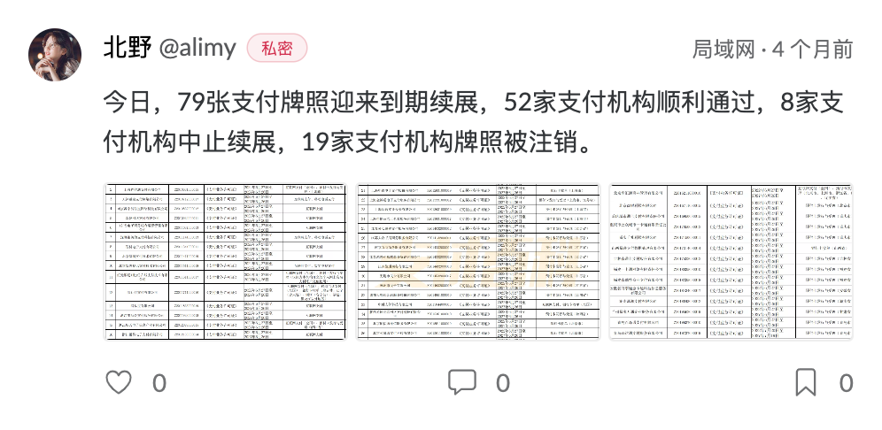

| 编号 | 作者 | 发表时间 | 变更时间 | 版本 | 状态 |
| ----- | ----- | ----- | ----- | ----- | ----- |
| 22110410 | 北野 | 2022-11-04 | 2023-01-04 | v1.0 | 提议 |

### Friendship功能项的设计概要
Friendship功能提供好友间分享推文信息的机制，更好的帮助用户建立自己的推文分享小圈子。Friendship本质上想优化的是泡泡广场页面推文列表的生成机制，开启功能后，推文列表只能获取 `公开/私密/好友` 的推文，每个用户都有属于自己的个性化推文列表。在提供个性化推文列表生成机制的同时，好友体系的建立也顺便帮助用户建立自己的个性化有限范围内的灵魂社交小圈子，只有相互间拥有个性化认同感的用户才能互为好友。

### 场景

* 私域小站点，流量小，但是希望控制推文访问权限；   
* 公域大站点或者小站点，推文数量庞大，更新频率高，泡泡广场列表有刷屏风险，需要一种更好的推文列表生成机制，为用户提供个性化推文列表服务，优化用户体验；  
* 单纯想建立一个好友体系；

### 需求

* 需要类似微信朋友圈这样的在好友间进行推文分享；
* 希望对推文访问权限进行控制，实现推文在有限空间内自由访问；
* 部署站点推文数量庞大，需要一种更好的推文列表生成机制，为用户提供个性化推文列表服务；
* 建立一个类似于微信朋友圈的弱关系好友体系，使得用户可以控制每一条推文的授权访问(公开/私密/好友可见)；
 
### 方案

#### 设计要点
* 建立好友体系，提供添加/解除好友关系的机制；
* 浏览好友列表的机制；
* 发送推文时可以设置推文的访问权限(可见性设置)；
* 推文展示时标记推文的可见性描述；

#### 设计细节 
* 参考实现(PR):  
[add support Friendship feature #192](https://github.com/rocboss/paopao-ce/pull/192)  

* 预览

|  |
| ----- |
| **泡泡广场** |
| |
| |
| |

### 疑问

1. 什么是弱关系好友体系？   
**弱关系好友** 在Friendship中的表现就是 **你只能通过对方发表的推文去判断这个人的思想三观是否符合你的脾胃进而让你决定是否要与对方建立好友关系；这种好友关系前期是非常薄弱，只能通过相互间的推文产生灵魂共鸣，进而互为兴趣、互为好友。** 有别于弱关系，微信的生态就天然建立在强关系之上，微信好友大部分都是自己熟人、朋友甚至亲人，因此微信的朋友圈就是强关系好友体系下的小圈子社交，有时谨言慎行就非常必要，导致有很多人随着年龄成长到某个阶段，对微信朋友圈非常不感冒，很少甚至没有发朋友圈的欲望了，究其原因有一部分可能是圈内好友太熟了甚至有点“严肃”。需要注意的是，有些人的表达欲望并没有因为微信朋友圈这种 **强关系好友** *圈内社交环境* 而降低，仅仅只是被压抑住了，那么一个**弱关系好友**体系或许可以打开这部分人的表达欲望，使得他们可以在有限可控圈子内尽情表达、享受言论的自由。  
2. 如何形成这种好友体系？    
形成好友体系分 **建立、维持、解除** 好友关系。Friendship提供 *建立/解除* 好友关系的机制，泡泡广场的推文列表依据这个好友体系为每个用户生成个性化推文列表。而好友关系的**维持**，本质上就是用户推文的持久更新、思想的持续演化，使得好友对你一直保持兴趣；Friendship也为每一条推文的访问权限进行**标记(私密/好友可见)**，这可以传达这样一种信息: **“时刻让好友知道我非常在乎好友、对好友特殊关照，你看这条推文就是只有我的好友(也就是你)才可以看到，够意思吧”！** 顺便一说，每一条推文的访问权限标记(公开/私密/好友可见)是建立Friendship弱关系体系的隐性催化剂，可以加速Friendship的形成。   
3. 如何开启这个功能？      
在配置文件config.yaml中的`Features`中添加`Friendship`功能项开启该功能：
    ```yaml
    ...
    # features中加上 Friendship
    Features:
      Default: ["Meili", "LoggerMeili", "Base", "Sqlite3", "BigCacheIndex", "MinIO", "Friendship"]
      Base: ["Redis", "PhoneBind"]
    ...
    ```

### 更新记录
#### v0.1(2022-11-04) - 北野
* 初始文档  

#### v0.2(2022-11-06) - 北野
* 添加初始文档内容  

#### v1.0(2023-01-04) - 北野
* 添加参考实现PR信息
