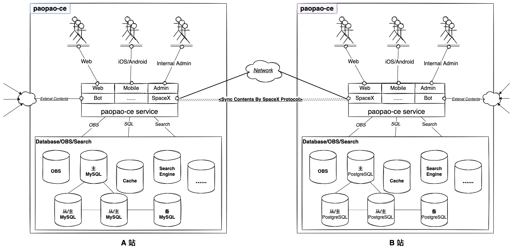
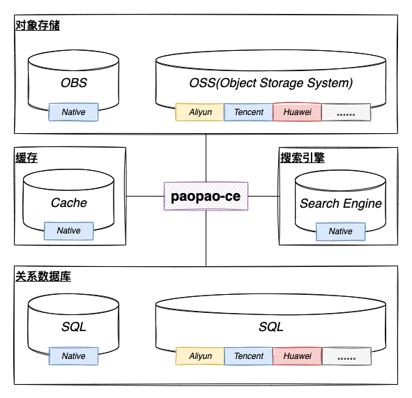
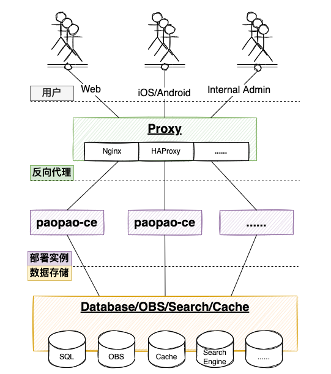

| 编号 | 作者 | 发表时间 | 变更时间 | 版本 | 状态 |
| ----- | ----- | ----- | ----- | ----- | ----- |
| 22110411 | 北野 | 2022-11-04 | 2023-01-13 | v1.1 | 提议 |

## 概述
paopao-ce是一个清新文艺的微社区，提供类似Twiter/微博的推文分享服务。paopao-ce的运营形态有点类似WordPress，只不过WordPress是使用PHP语言开发的博客平台，提供的是博客服务，而paopao-ce提供的是类似Twitter的推文分享服务。paopao-ce 让 **个人或小组织** 可以快速、方便的部署一个提供**推文分享服务**的小站点，在有限范围内形成一个友善的社交小圈子微社区。      

## 从运维角度思考  

| 实例部署 | 站点部署 |   
| ----- | ----- |   
| |  |   

部署paopao-ce实例 数据存储需要使用 关系数据库、对象存储、搜索引擎、缓存；paopao-ce支持多实例部署，具体文档请参考[deploy](../deploy/)。
#### 关系数据库
* 本地(Native) -  部署 MySQL/PostgreSQL或者paopao-ce内嵌Sqlite3数据库    
    MySQL/PostgreSQL 可以采用 一主多从+备、一主+备、多主+备 的模式部署，具体部署方式由运维者决定，paopao-ce本身不关心 关系数据库 的部署方式，仅仅使用标准的方式连接关系数据库使用其数据存储服务。
* 云关系数据库 - 部署 云关系数据库      
    阿里云、腾讯云、华为云都提供云关系数据库服务，如何开启服务请参考相应文档进行部署。paopao-ce采用标准方式连接其相应的数据库使用数据存储服务。

#### 对象存储
paopao-ce使用对象存储服务存储 图片/视频/附件 等推文资源。

* 本地(Native) - 部署OBS(Object Blob Storage System)    
    目前开发环境可以使用`localoss`功能提供简单的OBS服务, 也可以自行部署[MinIO](https://github.com/minio/minio)来提供对象存储服务。
* 云对象存储服务   
    阿里云、腾讯云、华为云都提供云对象存储服务，如何开启服务请参考相应文档进行部署。

#### 搜索引擎
paopao-ce目前支持 使用[Zinc](https://github.com/zinclabs/zinc) /[Meilisearch](https://github.com/meilisearch/meilisearch) 提供推文搜索服务，搜索引擎实例的部署请参考相应官方文档。

#### 缓存
paopao-ce目前支持Redis作为缓存存储引擎提供缓存服务，请参考Redis官方文档进行实例部署。

## 从代码实现角度思考
paopao-ce在代码实现上采用 **单体架构模式、分层设计、功能模块化**，架构设计上可能略显保守，但是在使用新技术上却非常积极，比如搜索引擎就采用了近来新星[Zinc](https://github.com/zinclabs/zinc) /[Meilisearch](https://github.com/meilisearch/meilisearch)，同时也不排斥各种云端服务，包括阿里云、腾讯云、华为云的对象存储服务、关系数据库服务等。paopao-ce始终秉持着 **包容并蓄、能用就上、去繁就简** 的架构思维，努力打造一个能 **稳定运行、代码清晰、功能可扩展** 的开源项目。   

## 从技术探索角度思考
IT世界是非常激动人心的，新技术层出不穷，在各自领域大展身手、大放异彩。作为开发者的我们首要目标当然是以产品为核心，不断的优化服务体验，也不吝啬于新技术的采用以达到更好的产品服务质量。新技术或者某种技术本身，是需要一个环境来支撑其运行、演进，脱离实际环境的技术演进，犹如纸上谈兵，实际效果是存疑的。开发者在研究一项(新)技术时，首先当然是知其然，了解其功能特性、适用场景；再而知其所以然，深入了解其设计原理、知悉其存在的局限等；进而知其不以为然，通过实践，找到技术的最适合场景、知悉其不适合的场景，或与其他技术配合使用，扬长避短，发挥各自的最佳效力以解决具体的事务。这些都是技术探索的通用流程，可以看出，一项技术的探索从陌生到一知半解再到了如指掌，需要一个漫长的过程以及一个技术探索的环境。有些技术的探索，确实需要一个具体的环境，才能更好的研究与实践，比如OBS、Search、Recommended discovery亦或各种云服务的使用、k8s的服务部署等，都需要一个具体的环境来进行技术探索。可以说以需求驱动的技术探索，也更能推进技术本身的不断演进。   
说这么多，这就引出了本节所要说的一个观点了，paopao-ce不仅仅是作为一个提供推文分享服务的产品，也能作为一些（新）技术的探索环境。比如OBS(对象存储服务)、推文搜索服务、推文/用户推荐发现服务、广场推文消息流服务等，都可以作为相应技术领域的技术探索环境，从实践中去检验技术的有效性，更好的推进技术的学习、实践、演进。作为开发者/学习者，也能在理论学习与实际环境中实践(新)技术找到一个平衡，更好、更快的掌握一项(新)技术，这也是paopao-ce的另一价值所在。**路漫漫其修远兮，吾将上下而求索**，用我们开发者的话来说，带着 **上下文(环境/需求)** 去探索（新)技术，或能事半功倍、得心应手。  

## 从人文角度思考
现在的互联网世界已经非常精彩，各种社交媒体平台琳琅满目，使用体验也非常友好。每个社交平台都有自己的运营方式，都有自己的核心用户群体，也有自己的产品灵魂，都在不断的进行生态演进。比如Twitter、微博都已经从最初的推文分享服务演进到一个成熟的传媒平台，注册用户非常庞大，日均访问PV也是一个惊人的数字，这就注定了平台的运营思维是多维度考量均衡的结果，只能做到让用户群体的大多数人用户体验友好，并不能满足所有人的需求。大平台有大平台的运营模式，小站点有小站点的维系空间。对于类似Twitter这样的推文分享服务，paopao-ce提供一种小站点部署模式，采用类似WordPress的运维模式，让 **个人/小组织** 能快速、便捷的拥有一个提供推文分享服务的小站点，以填补那些在大平台下难以享受到的用户体验，享受小圈子内的自由空间。

就像许巍唱的「曾经的你」这首歌中所说:*"曾梦想仗剑走天涯～ 看一看世界的繁华～ 年少的心总有些轻狂～ 如今你四海为家～ ......"* 曾经的你我也在 疯狂刷朋友圈、狂奔微博空间、畅游Twitter世界，但是随着环境的改变、岁月的洗礼、心路的淬炼后，你我可能已经不复当年的热情，逐渐淡出朋友圈、沦为微博的稀客，或许Twitter世界还有点吸引力，但是总感觉表达的欲望不复从前了。是什么原因变成这样的呢，原因可能很多，也各自有自己的不同情形所至于此。但是总归一条，那就是 **自由**; 如果有那么一个有限空间内，可以自由的 **谈天说地、品头论足、唠唠叨叨亦或自言自语**，你我是否又能燃起表达的激情呢？！从这个角度来说，paopao-ce就很契合这种需求，曾经你我想拥有一个自己的博客小站点而使用WordPress，那么今天想拥有一个自己的类似Twitter的推文分享服务小站点，部署paopao-ce或许也是一个不错的选择。 

一个产品应该有一个**属于自己的灵魂**，可以说 paopao-ce的宗旨就是 **打造一个清新文艺的微社区**。

## 疑问

1. paopao-ce主要针对哪些站点运营者？      
其实paopao-ce的运营形态有点类似WordPress，只不过WordPress是使用PHP语言开发的博客平台，提供的是博客服务，而paopao-ce提供的是类似Twitter的推文分享服务。paopao-ce 让 **个人或小组织** 可以快速、方便的部署一个提供**推文分享服务**的小站点，有限范围内形成一个友善的社交小圈子微社区。 
1. paopao-ce是一个清新文艺的微社区，微社区的 `微` 是如何界定的？          
    * 首先从站点用户流量层面，paopao-ce的部署一般针对的是小站点，注册用户不是很多，用户流量(QPS)也不会很高，这种情形本身很契合paopao-ce对自身微社区的服务定位；
    * 从代码实现层面思考，在数据存储层面的架构设计中已经假定paopao-ce提供服务的QPS不会很高，因此不会考虑类似数据库 **分库分表** 这样的设计优化来应对数据库CRUD的流量冲击，对站点推文数据的总容量也假定是单个SQL数据库提供满足查询需求的数据容量极限。
1. paopao-ce在代码实现上为什么采用单体架构模式？    
一个项目的架构设计是多方面考量均衡的结果，最终的目的是满足项目的需求与长远发展。
    * 从架构模式的角度来说，单体架构模式可以满足paopao-ce对自身服务定位的需求，完全有能力承载预期的用户流量QPS，所以采用单体模式架构设计是没有问题的；
    * 从运营者的角度来说，在能保障服务质量的前提下，最看重的还是运营成本的考量。提供一项保质保量的服务，可持续性是评价一项服务的重要指标。单体架构模式的项目部署简单，成本相对于分布式架构模式的项目也更低，架设门槛也没有那么高。*黑猫白猫，能抓老鼠就是好猫*， 在什么阶段就用什么技术，根据部署运营场景选择适合的技术来支撑服务，才是运营者明智的选择。
    * 现在不管是单体架构模式亦或是云原生的分布式架构模式，相应的技术栈生态都已经非常成熟，技术本身没有优劣之分，需要根据具体环境来适配合适的技术，这样才能在你保证服务质量的同时保证服务的可持续性与经济性。说白了就是paopao-ce目前采用单体架构模式的设计，满足优质服务的同时性价比最高。
1. 如果一个paopao-ce部署站点运营一段时间后QPS逐渐提高到一定程度，目前架构的paopao-ce无法满足进一步的用户流量冲击，是否会采用分布式技术栈进行优化？     
不会。paopao-ce将保守的采用目前的单体架构模式提供极致的QPS用户体验，如果确实需要超高QPS需求的实例部署，将另起炉灶开发另一款相应的产品，或许会采用云原生的分布式技术栈生态进行架构设计，这将是另一个paopao产品的故事序章了(前提是paopao能火出圈)。 

## 更新记录
#### v0.0(2022-11-04) - 北野
* 初始文档,先占个位置

#### v0.1(2022-12-17) - 北野
* 添加部署结构示意图

#### v0.2(2022-12-18) - 北野
* 添加部分内容

#### v1.0(2022-12-19) - 北野
* 补充部分内容

#### v1.1(2023-01-13) - 北野
* 补充 从技术探索角度思考 描述
