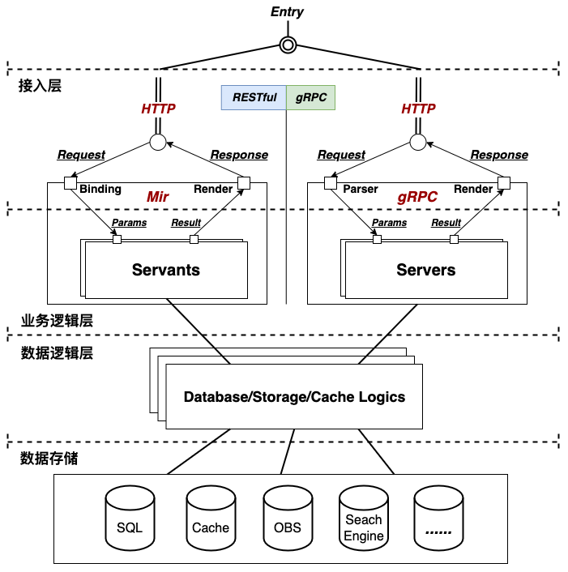

| 编号 | 作者 | 发表时间 | 变更时间 | 版本 | 状态 |
| ----- | ----- | ----- | ----- | ----- | ----- |
| 22112109 | 北野 | 2022-11-21 | 2023-01-04 | v1.1 | 提议 |

### 引入go-mir优化后端架构设计
 引入[github.com/alimy/mir/v3](https://github.com/alimy/mir)优化后端的架构设计，使得后端代码更具扩展型。

### 需求 
* 更方便添加后端功能项的实现；
* 优化代码结构，模块化、清晰化代码布局，使得更具扩展性；
* 兼容RESTful/gRPC 服务代码，RESTful API是服务于Web/Admin，gRPC API是提供给移动端(iOS/Android)的服务；
 
### 方案

依赖库:
* [go-mir](https://github.com/alimy/mir)

参考实现(PR):  
* [引入go-mir重构paopao-ce的接入层与业务逻辑层 #196](https://github.com/rocboss/paopao-ce/pull/196)  

### 疑问

1. 为什么引入go-mir？     
    * [go-mir](https://github.com/alimy/mir)是一套提供类似gRPC服务开发体验的快速开发RESTful API后端开发脚手架，巧妙的借用golang语法作为DSL描述RESTful API，通过代码生成的方式自动生成相对应的API接口、HTTP服务器框架初始化代码等，提供类似gRPC的开发体验，对后端开发者非常友好;
    * 引入go-mir的另一个主要目的是加速后端服务的开发，更好的保证代码风格的一致性;  
    * 践行 [006-关于paopao-ce的结构设计](006-关于paopao-ce的结构设计.md);
1. 为什么要兼容RESTful/gRPC服务？    
    * RESTful API是提供给Web端使用的，包括paopao-ce web端以及后期的运维端admin； gRPC API是提供给移动端(iOS/Android)使用的服务;
    * RESTful API天然对web端浏览器友好，而gRPC生态对后端、移动端天然友好，可以根据google-protocol-buffers DSL定义服务API自动生成服务端、客户端代码，非常利于开发，特别是移动端开发，省去了编写客户端网络数据服务相关的业务逻辑，只需要专注于页面逻辑编写，后端数据获取的网络数据访问逻辑直接调用自动生成的gRPC API客户端代码即可，大大的减轻移动端开发的心智负担;
    * 后端引入gRPC主要就是考虑到移动端(iOS/Android)开发的开发效率，在减轻移动端开发网络数据获取业务逻辑的心智负担上，gRPC生态与RESTful生态相比优势明显，因此强力引入;
    * 再一个就是[go-mir](https://github.com/alimy/mir) v3为RESTful服务的开发提供类似gRPC服务的开发体验，也为后端兼容RESTful/gRPC服务创造了很好的条件，只要代码结构组织清晰，将会有很好的后端开发体验; 
    >*目前移动端 iOS/Android APP还在规划中，这里后续的后端gRPC API服务也是为此做准备，敬请期待～*

### 更新记录
#### v0.0(2022-11-21) - 北野
* 初始文档

#### v1.0(2022-12-10) - 北野
* 添加内容

#### v1.1(2023-01-04) - 北野
* 添加参考实现PR信息
