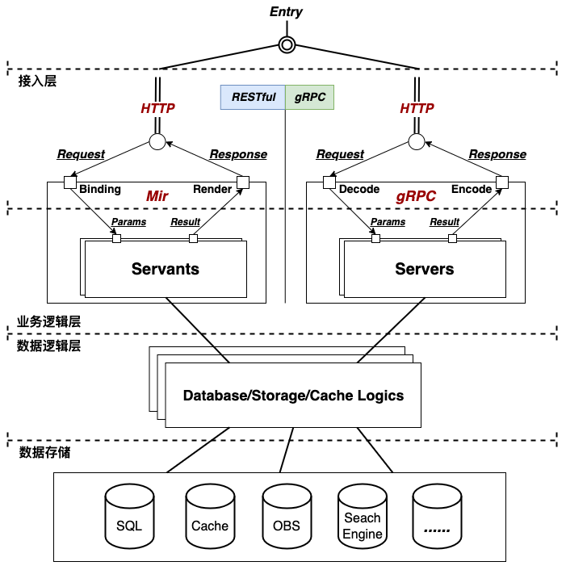

| 编号 | 作者 | 发表时间 | 变更时间 | 版本 | 状态 |
| ----- | ----- | ----- | ----- | ----- | ----- |
| 22112309 | 北野 | 2022-11-23 | 2022-01-01 | v1.0 | 提议 |

### 关于paopao-ce的结构设计
本文档主要讨论paopao-ce目前的代码结构，简要清晰的描述一个**API请求**从 **接受解析->逻辑处理->结果响应**的大概路径，帮助开发人员快速了解paopao-ce代码基的基本面，更好的融入paopao-ce的开发中做出PR贡献。     


### 两种服务 - RESTful API服务 与 gRPC服务
paopao-ce提供RESTful API与gRPC两种类型子服务，并且拥有**单实例多服务运行**的机制。RESTful API服务基于[gin](https://github.com/gin-gonic/gin)引擎实现，使用[go-mir](https://github.com/alimy/mir)脚手架辅助工具集实现RESTFul API从接口定义到代码自动生成的便捷开发体验。 gRPC服务使用[buf](https://github.com/bufbuild/buf)自动化辅助工具对gRPC服务从 `*.proto` DSL服务接口定义到接口代码自动生成的全流程管理。

### 结构说明
paopao-ce采用清晰的分层结构设计，主要包括 **接入层、业务逻辑层、数据逻辑层、数据存储**。
* 接入层    
    RESTful API服务的接入层由 [gin](https://github.com/gin-gonic/gin)引擎 与 [go-mir](https://github.com/alimy/mir)生成的 **Binding/Render** 代码共同组成。当一个HTTP Request被http server接受后，通过[gin](https://github.com/gin-gonic/gin)的路由机制，由相应的[go-mir](https://github.com/alimy/mir)生成的`Binding`将请求解析后传入 **业务逻辑层**中相对应的 子服务Servants 完成业务处理后获得结果，[go-mir](https://github.com/alimy/mir)生成的`Render`把结果渲染后生成对应的 HTTP Response发送出去以完成一个HTTP请求。    
    gRPC服务的接入层由其对应的gRPC服务器引擎组成，当一个RPC请求过来后，先把请求解码解析后传入 **业务逻辑层**中相对应的 子服务Servers 完成业务处理后获得结果，将处理结果编码后生成对应的 HTTP Response发送出去就完成了一个RPC请求的完整流程。   
* 业务逻辑层   
    RESTful API服务的业务逻辑层是由[go-mir](https://github.com/alimy/mir)依据接口定义自动生成的**Servants服务接口**组成，开发人员需要实现这些接口以提供相应的业务逻辑。gRPC也是一样的，业务逻辑需要通过实现gRPC依据proto DSL定义接口自动生成的服务接口来提供相应业务处理服务。    
* 数据逻辑层   
    paopao-ce将所有与数据存储相关的服务都统一定义成接口，包括**SQL服务、缓存服务、OBS服务、Search服务** 等，然后根据具体的部署环境选择适配的相应存储服务实现。比如OBS服务，定义了统一的操作对象存储的服务接口，然后提供阿里云、腾讯云、华为云、MinIO、S3、Localoss等的服务适配实现，这样就可以根据不同的部署环境切换使用不同的对象存储服务实现。   
* 数据存储  
    数据存储包括 SQL存储(MySQL/PostgreSQL/Sqlite3)、Cache、OBS、Search Engine(Zinc/Meilisearch)等，paopao-ce本身不关心具体的数据存储是如何部署的，一般是通过对应的标准方式连接部署实例以获取相应存储服务。   

### paopao-ce代码目录的说明
```sh
tree -L 2
.
|-- auto
|   |-- api
|   `-- rpc
|-- internal
|   |-- conf
|   |-- core
|   |-- dao
|   |-- ims
|   |-- migration
|   |-- model
|   |-- obs
|   |-- servants
|   `-- service
|-- main.go
|-- mirc
|-- proto
|-- release
`-- web
```
* 根目录的`mirc`包含RESTful API的[go-mir](https://github.com/alimy/mir)服务接口定义文件, `auto/api`目录包含[go-mir](https://github.com/alimy/mir)自动生成的服务接口代码；
* 目录`proto`包含gRPC的proto服务接口定义文件，自动生成的服务接口代码包含在`auto/rpc`目录中；
* 业务逻辑层的代码都包含在`internal/servants`目录，包括RESTful服务以及gRPC服务的业务逻辑处理代码都包含在这个目录中；   
* `internal/core`包含所有数据逻辑层的服务接口定义，相应的数据逻辑层服务接口实现代码都包含在`internal/dao`目录中；
* 一些大的功能模块统一放置于`internal`目录中，以降低代码目录深度；比如数据库迁移功能模块`migration`的代码包含在`internal/migration`目录、 消息推送功能模块`ims` -> `internal/ims`, 简单本地OBS功能`obs` -> `internal/obs` 等；
* `internal/service`目录包含paopao-ce所有子服务(`Web`、`Admin`、`Bot`、`SpaceX`、`Mobile` ...)的初始化逻辑代码；  
* `internal/conf`目录包含全局配置相关的逻辑代码；  


### 疑问

1. 为什么要引入[go-mir](https://github.com/alimy/mir)?       
**工欲善其事，必先利其器**。为了RESTFul API的后端开发体验可以媲美gRPC，本人特意打造[go-mir](https://github.com/alimy/mir) v3版本来满足需求。[go-mir](https://github.com/alimy/mir)是一套使用golang自身语言生态实现的RESTFul API从接口定义到代码自动生成的脚手架辅助工具集，便捷的实现快速后端开发体验，颇有 *“程咬金的三板斧，简单抡着就完事”* 的韵味。而从[go-mir](https://github.com/alimy/mir)的官方文档参考也可以看出，其生成的代码也确实就将一个HTTP的请求/响应简单分成 `请求绑定`->`业务逻辑`->`结果渲染`三个步骤去完成，生成的代码结构简单清晰，与gRPC的生成代码有点类似。
1. 为什么要兼容RESTful服务与gRPC服务？         
RESTful服务与gRPC服务各自有擅长的场景，在合适的场景使用最适合的技术去做相应的适配，这是paopao-ce秉持的代码开发原则之一。 

### 更新记录
#### v0.0(2022-11-23) - 北野    
* 初始文档， 先占个位置

#### v0.1(2022-12-23) - 北野   
* 添加部分内容    

#### v1.0(2023-01-01) - 北野   
* 添加部分内容    
